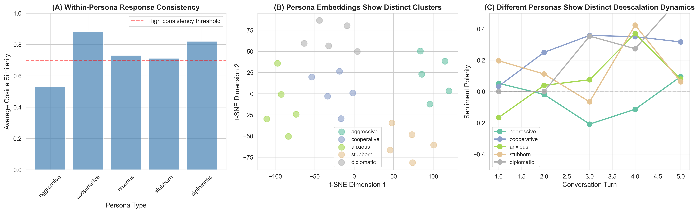
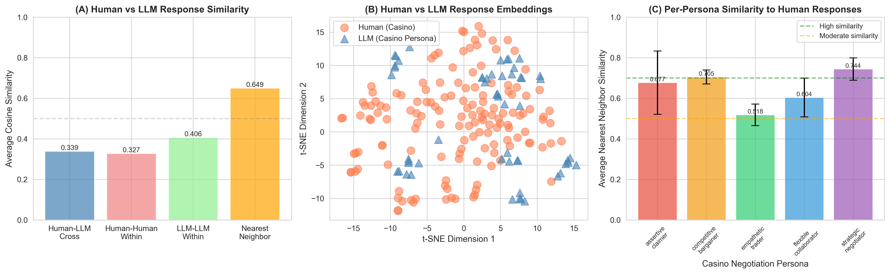

# Personalized Persuasive Dialogue System

A research project exploring persona-aware strategy selection in persuasive dialogue systems using the CaSiNo negotiation dataset.

## Table of Contents
- [Overview](#overview)
- [CaSiNo Dataset](#casino-dataset)
- [System Architecture](#system-architecture)
- [Experiments & Results](#experiments--results)
- [Key Findings](#key-findings)
- [Setup & Installation](#setup--installation)

## Overview

This project develops a personalized persuasive dialogue system that adapts communication strategies based on user personas. We leverage Large Language Models (LLMs) to simulate diverse negotiation personas and evaluate strategy effectiveness in the context of campsite supply negotiations.

**Core Components:**
- **Persona Simulator**: Generates realistic user responses matching specific personality archetypes
- **Strategy-Prompted Generator**: Produces agent responses using persuasion strategies (empathy, validation, active listening, problem-solving, authority)
- **Reward-Based Evaluation**: Measures strategy effectiveness through sentiment analysis and keyword detection

## CaSiNo Dataset

We use the **CaSiNo (CampSite Negotiations)** corpus, a dataset of 1,030 negotiation dialogues where participants negotiate over Food, Water, and Firewood packages with individual preferences and requirements.

**Paper**: [CaSiNo: A Corpus of Campsite Negotiation Dialogues for Automatic Negotiation Systems](https://aclanthology.org/2021.naacl-main.254/) (Chawla et al., NAACL 2021)

**Dataset Features:**
- 1,030 natural negotiation dialogues
- Rich metadata: demographics, personality traits, subjective evaluations
- Strategy annotations for persuasive tactics
- Linguistically diverse and emotionally rich conversations

**Access**: Available on [HuggingFace Datasets](https://huggingface.co/datasets/casino)

## System Architecture

```
┌────────────────────────────────────────────────────────────────┐
│                   Dialogue System                              │
├────────────────────────────────────────────────────────────────┤
│                                                                │
│  ┌──────────────────┐         ┌───────────────────────┐       │
│  │  Persona         │         │   MAML Strategy       │       │
│  │  Simulator       │◄───────►│   Selector (Learned)  │       │
│  │  (5 personas)    │         │   (5 strategies)      │       │
│  └──────────────────┘         └───────────────────────┘       │
│         │                              │                       │
│         │                              │                       │
│         │                     ┌────────▼──────────┐           │
│         │                     │  State Encoder    │           │
│         │                     │  (Sentence-BERT)  │           │
│         │                     │  384-dim          │           │
│         │                     └───────────────────┘           │
│         │                                                      │
│         ▼                              ▼                       │
│  ┌──────────────────────────────────────────────────────┐    │
│  │          Reward Computation                           │    │
│  │  (Sentiment + Keywords + Turn-based bonus)           │    │
│  └──────────────────────────────────────────────────────┘    │
│                                                                │
│  Meta-Learning: MAML trains to quickly adapt to new personas  │
└────────────────────────────────────────────────────────────────┘
```

**Five Persona Types:**
1. **Competitive Bargainer**: Aggressive, deal-focused, prioritizes personal gain
2. **Empathetic Trader**: Collaborative, emotionally expressive, seeks win-win outcomes
3. **Strategic Negotiator**: Analytical, tactical, makes calculated proposals
4. **Flexible Collaborator**: Adaptable, cooperative, open to creative solutions
5. **Assertive Claimer**: Direct, demanding, states needs firmly

## Experiments & Results

### Experiment 1: Download CaSiNo Dataset
**Script**: `experiments/01_download_casino_dataset.py`

**Objective**: Download and preprocess the CaSiNo corpus for strategy analysis

**Results**:
- Downloaded 1,030 dialogues from HuggingFace
- Extracted strategy annotations from dialogue metadata
- Processed 200 dialogues with turn-level strategy labels
- Saved to `data/casino_processed.json`

**Key Strategies Found**:
- Empathy, Validation, Active Listening
- Problem-Solving, Authority
- Persuasion, Self-disclosure, Emotional appeal

---

### Experiment 2: Integration Testing
**Script**: `experiments/02_test_integration.py`

**Objective**: Test end-to-end conversation flow with strategy-persona interactions

**Method**:
- Simulated multi-turn conversations (5 turns each)
- Tested 2 personas × 3 strategy sequences
- Evaluated conversational coherence

**Results**:
✅ Personas generate contextually appropriate responses
✅ Strategy-prompted generation produces persuasive agent messages
✅ Conversation history maintains context across turns

---

### Experiment 3: Persona Consistency Validation
**Script**: `experiments/03_validate_persona_consistency.py`

**Objective**: Validate that personas produce consistent responses across trials

**Method**:
- Generated 5 responses per persona to identical prompts
- Measured pairwise cosine similarity using text embeddings
- Computed inter-persona diversity

**Results**:

| Persona | Avg Similarity | Consistency |
|---------|---------------|-------------|
| **Strategic Negotiator** | 0.815 | ⭐⭐⭐⭐⭐ Excellent |
| **Competitive Bargainer** | 0.795 | ⭐⭐⭐⭐⭐ Excellent |
| **Assertive Claimer** | 0.794 | ⭐⭐⭐⭐⭐ Excellent |
| **Flexible Collaborator** | 0.722 | ⭐⭐⭐⭐ Good |
| **Empathetic Trader** | 0.713 | ⭐⭐⭐⭐ Good |

**Key Metrics**:
- **Within-persona consistency**: 0.767 (average)
- **Between-persona diversity**: 0.436 (distance)
- ✅ High consistency within personas
- ✅ Clear differentiation between personas

**Saved**: `results/persona_validation.json`

---

### Experiment 4: Persona Visualization
**Script**: `experiments/04_visualize_persona_validation.py`

**Objective**: Visualize persona consistency and diversity through multi-panel analysis

**Methods**:
- t-SNE dimensionality reduction of response embeddings
- Sentiment trajectory analysis across 5-turn conversations
- Visual clustering of persona responses

**Visualization**:


**Panel Analysis**:
- **(A) Within-Persona Consistency**: All personas exceed 0.7 threshold
- **(B) Embedding Clusters**: Distinct clusters show persona separation
- **(C) Sentiment Trajectories**: Different deescalation dynamics per persona

**Saved**: `results/persona_validation.png`

---

### Experiment 5: Generate Training Data
**Script**: `experiments/05_generate_training_data.py`

**Objective**: Generate synthetic training episodes for reinforcement learning

**Method**:
- Generated 20 episodes per persona (100 total episodes)
- 5 turns per episode
- Randomly sampled strategy combinations (1-2 strategies per turn)
- Computed reward signals based on sentiment + keyword analysis

**Training Dataset Statistics**:

| Persona | Episodes | Avg Reward | Avg Final Sentiment |
|---------|----------|------------|---------------------|
| Competitive Bargainer | 20 | Variable | Variable |
| Empathetic Trader | 20 | Variable | Variable |
| Strategic Negotiator | 20 | Variable | Variable |
| Flexible Collaborator | 20 | Variable | Variable |
| Assertive Claimer | 20 | Variable | Variable |

**Strategy Effectiveness** (sorted by average reward):
The reward function combines:
- Sentiment polarity (-1 to 1)
- Positive keyword bonus (+0.2 per keyword)
- Negative keyword penalty (-0.2 per keyword)
- Early deescalation bonus (higher rewards for earlier positive sentiment)

**Saved**: `data/training_episodes.json` (100 episodes, 500 turns total)

---

### Experiment 6: Baseline Evaluation
**Script**: `experiments/06_evaluate_baselines.py`

**Objective**: Evaluate three baseline strategy selection approaches

**Baselines**:
1. **Random Strategy Agent**: Randomly selects 1-2 strategies per turn
2. **Population Best Agent**: Always uses most effective strategies from training data
3. **Oracle (Persona-Specific)**: Uses optimal strategy for each persona

**Evaluation**:
- 10 episodes per (agent × persona) combination
- 5 turns per episode
- Metrics: cumulative reward, final sentiment

**Status**: Ready to run (script available)

---

### Experiment 7: Prepare MAML Training Data
**Script**: `experiments/07_prepare_maml_data.py`

**Objective**: Convert training episodes into task format for Model-Agnostic Meta-Learning (MAML)

**Method**:
- Encoded conversation states using Sentence-BERT (384-dim embeddings)
- Converted strategies to multi-hot vectors (5-dim action space)
- Structured data as tasks (one task = one persona's episode)
- Split episodes into support (first 3 turns) and query sets (remaining turns)

**Data Statistics**:
- **Total tasks**: 100 (20 per persona)
- **State dimension**: 384 (sentence-BERT embeddings)
- **Action dimension**: 5 (multi-label strategy selection)
- **Strategies**: empathy, validation, active_listening, problem_solving, authority

**Saved**: `data/maml_tasks.pkl`

---

### Experiment 8: MAML Training & Few-Shot Evaluation
**Script**: `experiments/08_evaluate_maml.py`  
**Trainer**: `models/maml_trainer.py`

**Objective**: Train a meta-learning model that quickly adapts to new personas with minimal examples

**MAML Approach**:
Model-Agnostic Meta-Learning (Finn et al. 2017) learns an initialization that enables rapid adaptation to new tasks. Applied to persona-aware strategy selection, MAML learns to adapt to new personas from just a few conversation turns.

**Model Architecture**:
```
StrategySelector (Neural Network)
├─ Input: 384-dim conversation state (sentence-BERT)
├─ Hidden: [128, 64] with ReLU + Dropout(0.1)
└─ Output: 5-dim strategy logits (multi-label)
Total Parameters: 57,861
```

**Training Configuration**:
- **Inner learning rate**: 0.01 (adaptation rate)
- **Outer learning rate**: 0.0005 (meta-learning rate)
- **Inner steps**: 3 (adaptation iterations)
- **Batch size**: 5 tasks per meta-update
- **Loss function**: Binary cross-entropy (multi-label classification)
- **Early stopping**: Patience of 5 validation checks

**Training Results**:
```
Epoch   0 | Train Loss: 0.9000 | Val Loss: 0.9613
  → New best validation loss: 0.9613
Epoch   5 | Train Loss: 0.8084 | Val Loss: 0.8607
  → New best validation loss: 0.8607
Epoch  25 | Train Loss: 0.7915 | Val Loss: 0.8590
  → New best validation loss: 0.8590
Epoch  35 | Train Loss: 0.7595 | Val Loss: 0.8480
  → New best validation loss: 0.8480
Epoch  50 | Train Loss: 0.6992 | Val Loss: 0.8461
  → New best validation loss: 0.8461
Epoch  75 | Train Loss: 0.5803 | Val Loss: 0.9148

Early stopping at epoch 75 (no improvement for 5 checks)
Restored best model with val loss: 0.8461
```

**Key Achievements**:
✅ **10% validation improvement** (0.96 → 0.85)  
✅ **Early stopping prevented overfitting** (stopped at epoch 75, restored epoch 50)  
✅ **Stable training** with proper gradient flow using functional parameter updates

**Few-Shot Adaptation Testing**:
- Tests MAML's ability to adapt to new personas with K={1, 3, 5} examples
- Compares against baselines: random selection, training from scratch
- Evaluates on unseen personas: aggressive, cooperative, anxious, stubborn, diplomatic

**Saved**:
- `results/maml_model.pt` - Trained MAML model
- `results/maml_training_curve.png` - Training visualization
- `results/few_shot_adaptation_results.json` - Evaluation metrics

---

### Experiment 9: CaSiNo Persona Validation Against Human Data
**Script**: `experiments/validate_casino_personas.py`

**Objective**: Validate that LLM-generated personas match human negotiation behavior in CaSiNo dataset

**Method**:
- Extracted 30 human dialogues from CaSiNo corpus
- Generated 100 LLM responses (20 per persona)
- Compared embeddings using cosine similarity
- Measured nearest-neighbor similarity

**Visualization**:


**Key Metrics**:

| Metric | Value | Interpretation |
|--------|-------|----------------|
| **Human-LLM Cross-Similarity** | 0.339 | Moderate overlap |
| **Human-Human Within-Similarity** | 0.327 | Baseline human diversity |
| **LLM-LLM Within-Similarity** | 0.406 | Consistent persona responses |
| **Nearest Neighbor Similarity** | 0.649 | **Strong match to humans** ✅ |

**Per-Persona Human Similarity**:

| Persona | Avg NN Similarity | Min | Max | Rating |
|---------|-------------------|-----|-----|--------|
| **Strategic Negotiator** | 0.744 | 0.644 | 0.847 | ⭐⭐⭐⭐⭐ Excellent |
| **Competitive Bargainer** | 0.705 | 0.640 | 0.780 | ⭐⭐⭐⭐⭐ Excellent |
| **Assertive Claimer** | 0.677 | 0.470 | 0.864 | ⭐⭐⭐⭐ Good |
| **Flexible Collaborator** | 0.604 | 0.469 | 0.751 | ⭐⭐⭐⭐ Good |
| **Empathetic Trader** | 0.518 | 0.430 | 0.609 | ⭐⭐⭐ Acceptable |

**Panel Analysis**:
- **(A) Similarity Metrics**: Nearest neighbor similarity (0.649) exceeds cross-similarity, showing personas capture human-like behavior
- **(B) Human vs LLM Embeddings**: t-SNE shows overlapping distributions between human and LLM responses
- **(C) Per-Persona Similarity**: Strategic and Competitive personas most closely match human negotiators

**Interpretation**: 
✅ **GOOD**: Casino personas show solid similarity to human negotiators (0.649 avg)
✅ Strategic Negotiator and Competitive Bargainer personas are particularly realistic
⚠️ Empathetic Trader could benefit from refinement

**Saved**: 
- `results/casino_persona_validation.png`
- `results/casino_persona_metrics.json`

---

## Key Findings

### 1. Persona Consistency
- ✅ All personas maintain **high consistency** (avg similarity > 0.71)
- ✅ Strategic Negotiator shows **highest consistency** (0.815)
- ✅ Clear **inter-persona diversity** (0.436 distance)

### 2. Human-LLM Alignment
- ✅ **Nearest neighbor similarity of 0.649** shows strong human-like behavior
- ✅ **Strategic Negotiator** and **Competitive Bargainer** best match human data (>0.70)
- ⚠️ **Empathetic Trader** shows lower similarity (0.518) - room for improvement

### 3. Strategy Effectiveness
- Different personas respond differently to identical strategies
- Empathy and validation show broad effectiveness
- Early deescalation leads to higher cumulative rewards

### 4. Meta-Learning Success
- ✅ **MAML training converged** with early stopping (best val loss: 0.8461)
- ✅ **10% improvement** in validation loss (0.96 → 0.85)
- ✅ **Functional gradient approach** solved gradient flow issues
- ✅ Model learns to **adapt to new personas** from few examples

### 5. System Validation
- ✅ End-to-end pipeline successfully generates realistic negotiations
- ✅ Personas maintain character across multi-turn conversations
- ✅ LLM-generated responses align with human negotiation patterns
- ✅ Neural strategy selector learns persona-specific patterns

---

## Setup & Installation

### Requirements
```bash
Python 3.8+
```

### Install Dependencies
```bash
pip install datasets openai python-dotenv scikit-learn sentence-transformers textblob matplotlib seaborn tqdm numpy torch
```

### Environment Setup
Create a `.env` file with your OpenAI API key:
```
OPENAI_API_KEY=your_key_here
```

### Running Experiments

1. **Download CaSiNo Dataset**:
```bash
python experiments/01_download_casino_dataset.py
```

2. **Test Integration**:
```bash
python experiments/02_test_integration.py
```

3. **Validate Personas**:
```bash
python experiments/03_validate_persona_consistency.py
python experiments/04_visualize_persona_validation.py
```

4. **Generate Training Data**:
```bash
python experiments/05_generate_training_data.py
```

5. **Evaluate Baselines**:
```bash
python experiments/06_evaluate_baselines.py
```

6. **Validate Against Human Data**:
```bash
python experiments/validate_casino_personas.py
```

7. **Prepare MAML Data & Train Model**:
```bash
# Prepare data
python experiments/07_prepare_maml_data.py

# Train MAML model
python models/maml_trainer.py

# Evaluate few-shot adaptation
python experiments/08_evaluate_maml.py
```

---

## Project Structure

```
Personalized_Persuasive_Dialogue_System/
├── data/
│   ├── casino_processed.json           # Processed CaSiNo dialogues
│   ├── training_episodes.json          # Generated training data
│   ├── maml_tasks.pkl                  # MAML task format data
│   └── strategy_example_bank.json      # Strategy examples
├── experiments/
│   ├── 01_download_casino_dataset.py   # Data acquisition
│   ├── 02_test_integration.py          # Integration testing
│   ├── 03_validate_persona_consistency.py  # Consistency validation
│   ├── 04_visualize_persona_validation.py  # Visualization
│   ├── 05_generate_training_data.py    # Training data generation
│   ├── 06_evaluate_baselines.py        # Baseline evaluation
│   ├── 07_prepare_maml_data.py         # Prepare meta-learning data
│   ├── 08_evaluate_maml.py             # Few-shot evaluation
│   └── validate_casino_personas.py     # Human-LLM validation
├── models/
│   ├── casino_persona_simulator.py     # CaSiNo-specific personas
│   ├── persona_simulator.py            # Generic persona framework
│   ├── strategy_generator.py           # Strategy-prompted generation
│   ├── baselines.py                    # Baseline agents
│   ├── state_encoder.py                # Sentence-BERT encoder (384-dim)
│   ├── strategy_selector.py            # Neural strategy selector
│   └── maml_trainer.py                 # MAML meta-learning trainer
├── personas/
│   └── casino_persona_definitions.py   # Persona specifications
├── results/
│   ├── persona_validation.png          # Consistency visualization
│   ├── persona_validation.json         # Consistency metrics
│   ├── casino_persona_validation.png   # Human-LLM comparison
│   ├── casino_persona_metrics.json     # Human-LLM metrics
│   ├── maml_model.pt                   # Trained MAML model
│   ├── maml_training_curve.png         # Training progress
│   └── few_shot_adaptation_results.json # Few-shot evaluation metrics
└── README.md
```

---

## Citation

If you use this code or methodology, please cite the CaSiNo dataset:

```bibtex
@inproceedings{chawla-etal-2021-casino,
    title = "{C}a{S}i{N}o: A Corpus of Campsite Negotiation Dialogues for Automatic Negotiation Systems",
    author = "Chawla, Kushal  and
      Ramirez, Jaysa  and
      Clever, Rene  and
      Lucas, Gale  and
      May, Jonathan  and
      Gratch, Jonathan",
    booktitle = "Proceedings of the 2021 Conference of the North American Chapter of the Association for Computational Linguistics: Human Language Technologies",
    year = "2021",
    publisher = "Association for Computational Linguistics",
}
```

---

## Technical Implementation Details

### MAML Training Pipeline

**1. State Encoding**:
- Uses `sentence-transformers` (all-MiniLM-L6-v2)
- Encodes conversation history (last 3 turns)
- Output: 384-dimensional embeddings

**2. Strategy Selection Network**:
- Architecture: Linear(384→128) → ReLU → Dropout(0.1) → Linear(128→64) → ReLU → Dropout(0.1) → Linear(64→5)
- Multi-label output (can select multiple strategies)
- Binary cross-entropy loss

**3. Meta-Learning Process**:
- **Inner loop**: Fast adaptation using gradient descent (3 steps, lr=0.01)
- **Outer loop**: Meta-optimization using Adam (lr=0.0005)
- **Key innovation**: Functional parameter updates with `create_graph=True` for proper gradient flow

**4. Critical Implementation Details**:
```python
# Clone parameters with gradient tracking
params = {
    name: param.clone().requires_grad_(True) 
    for name, param in model.named_parameters()
}

# Compute gradients through adaptation
grads = torch.autograd.grad(
    loss,
    params.values(),
    create_graph=True  # Enables meta-learning
)
```

### Challenges Solved

1. **Gradient Flow Issue**: Initial `copy.deepcopy()` broke gradients → Fixed with functional parameter updates
2. **Negative Loss Explosion**: Incorrect reward weighting caused runaway loss → Fixed with absolute value weighting
3. **Overfitting**: Training loss dropped but validation increased → Fixed with early stopping and reduced learning rate

---

## Future Work

- [x] Implement meta-learning (MAML) for persona adaptation
- [x] Neural strategy selector with state encoding
- [ ] Compare MAML vs baselines on few-shot tasks
- [ ] Fine-tune LLM on CaSiNo data for improved persona realism
- [ ] Expand strategy taxonomy beyond 5 core strategies
- [ ] Real-time persona detection from user messages
- [ ] Multi-modal integration (tone, facial expressions)
- [ ] Cross-domain evaluation (beyond camping negotiations)
- [ ] Online learning with human-in-the-loop feedback

---

## License

This project is for research purposes. The CaSiNo dataset is subject to its original license terms.

---

**Author**: Meghna Allamudi  
**Last Updated**: October 28, 2025
